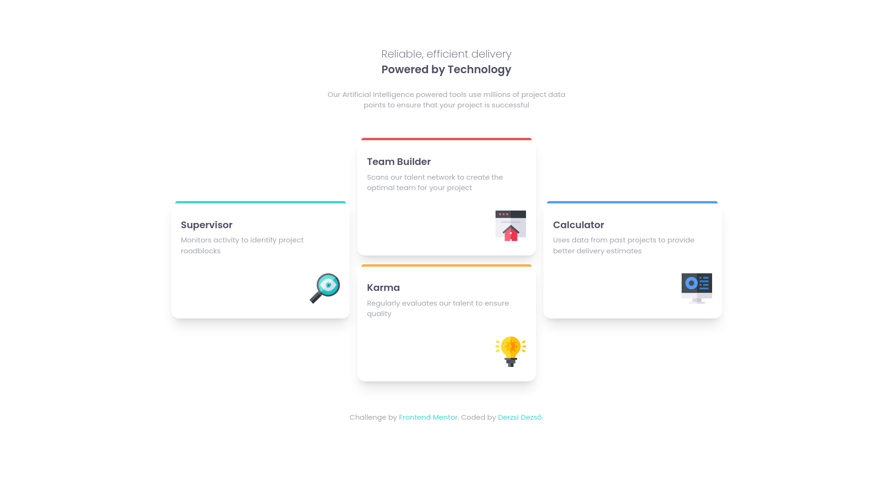
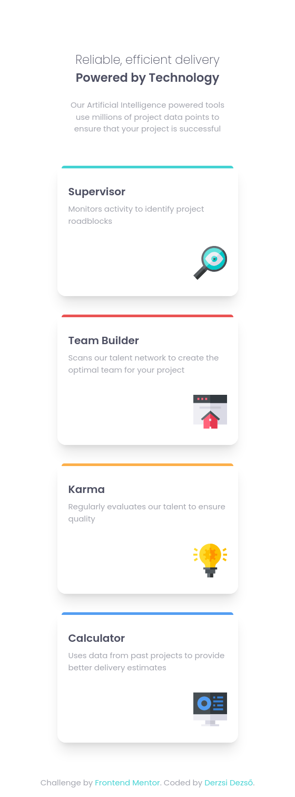

# Frontend Mentor - Four card feature section solution

This is a solution to the [Four card feature section challenge on Frontend Mentor](https://www.frontendmentor.io/challenges/four-card-feature-section-weK1eFYK). Frontend 

### Screenshot

### Links

- Solution URL:

### Built with

- Semantic HTML5 markup
- CSS custom properties
- CSS Grid
- Mobile-first workflow

### What I learned
grid areas

## Author

- Website - [Dezső Derzsi]
- Frontend Mentor - [@yDeDe-code](https://www.frontendmentor.io/profile/DeDe-code)
